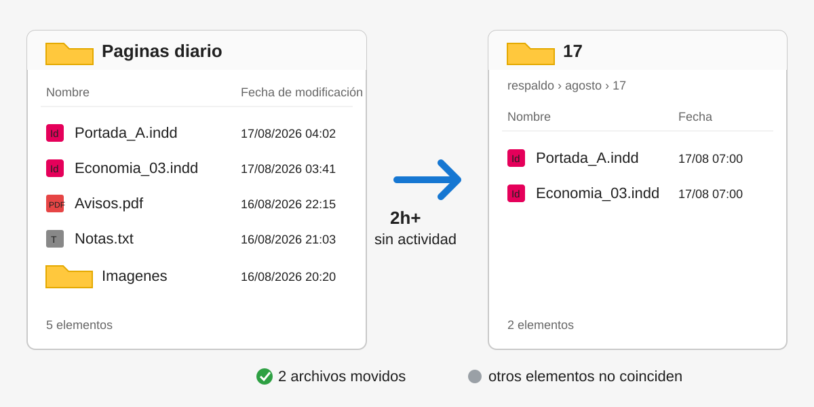

# Organizador de archivos y respaldos para Windows

Automatización en Python para organizar archivos de Adobe InDesign (`.indd`) generados durante una jornada nocturna y moverlos a una estructura de respaldo por mes y día.

El proyecto está pensado para evitar una tarea manual repetitiva: revisar al cierre de la jornada qué archivos corresponden al turno, comprobar que la carpeta ya no está siendo utilizada y mover los archivos elegibles sin sobrescribir respaldos existentes.



## Problema que resuelve

En un flujo de trabajo donde los archivos `.indd` se producen durante la noche, el programa permite ejecutar el respaldo de forma repetible sin tener que seleccionar y mover los archivos manualmente cada día.

La implementación actual trabaja con una jornada fija que comienza a las **19:00 del día anterior** y termina a las **06:59:59 del día de cierre**. Antes de mover archivos también exige que la carpeta de origen lleve al menos **120 minutos sin actividad**.

## Funcionamiento general

Al ejecutarse, el programa:

1. carga las rutas y el nivel de logging desde `.env`;
2. comprueba que la carpeta de origen exista;
3. crea la carpeta base de respaldo si todavía no existe;
4. revisa la modificación más reciente de los elementos del nivel principal de la carpeta de origen, excluyendo la propia carpeta de respaldo;
5. si hubo actividad durante los últimos 120 minutos, no mueve archivos;
6. busca únicamente archivos `.indd` del nivel principal cuya fecha de modificación pertenezca a la jornada nocturna;
7. crea un destino con el formato `respaldo/<mes>/<día>`;
8. mueve cada archivo elegible de forma independiente;
9. si el nombre ya existe en el destino, genera un nombre como `pagina (1).indd`, `pagina (2).indd`, etc.;
10. registra un resumen con archivos movidos, omitidos y errores.

Por ejemplo, para una fecha de cierre `17-08-2026`, la ventana válida comienza el 16 de agosto a las 19:00 y termina el 17 de agosto a las 06:59:59.

## Requisitos

- Windows.
- Python 3.11 o superior.
- PowerShell para el script incluido de Windows Task Scheduler.
- Git, si se instala clonando el repositorio.

Las dependencias Python declaradas son `python-dotenv` y `pytest`.

## Instalación

### 1. Clonar el repositorio

```powershell
git clone https://github.com/Andrefnx/Windows_File_Backup.git
cd Windows_File_Backup
```

### 2. Crear un entorno virtual

```powershell
python -m venv .venv
```

### 3. Activarlo

```powershell
.\.venv\Scripts\Activate.ps1
```

### 4. Instalar dependencias

```powershell
pip install -r requirements.txt
```

### 5. Crear la configuración local

```powershell
Copy-Item .env.example .env
```

Después edita `.env` con las rutas correspondientes a tu equipo.

## Configuración mediante `.env`

El programa lee tres variables:

```env
SOURCE_FOLDER=C:\Ruta\De\Trabajo
BACKUP_FOLDER=C:\Ruta\De\Trabajo\respaldo
LOG_LEVEL=INFO
```

- `SOURCE_FOLDER`: carpeta donde se encuentran los archivos que se revisarán.
- `BACKUP_FOLDER`: carpeta base donde se crearán los respaldos por mes y día.
- `LOG_LEVEL`: nivel estándar de logging de Python, por ejemplo `INFO` o `DEBUG`.

`SOURCE_FOLDER` y `BACKUP_FOLDER` son obligatorias. Un `LOG_LEVEL` no reconocido se considera un error de configuración.

El archivo `.env` está excluido mediante `.gitignore`; no deben publicarse allí rutas privadas del equipo. `.env.example` sirve únicamente como plantilla.

## Ejecución

### Ejecución normal

```powershell
python src/main.py
```

Si no se especifica una fecha, se utiliza la fecha local actual como fecha de cierre.

También es posible indicar una fecha manualmente en formato `DD-MM-AAAA`:

```powershell
python src/main.py --date 17-08-2026
```

Esto cambia la jornada que se utiliza para seleccionar archivos; no modifica las fechas de los archivos.

### Dry-run

```powershell
python src/main.py --dry-run
```

El modo `--dry-run` realiza las comprobaciones y muestra mediante logs qué archivos se moverían, pero no crea la carpeta diaria ni mueve los `.indd`.

Puede combinarse con una fecha:

```powershell
python src/main.py --date 17-08-2026 --dry-run
```

## Programación con Windows Task Scheduler

El repositorio incluye `scripts/setup_task.ps1` para registrar una tarea diaria en el Programador de tareas de Windows.

```powershell
powershell -ExecutionPolicy Bypass -File .\scripts\setup_task.ps1
```

La configuración implementada por el script:

- crea la tarea `Organizador-Respaldos-Windows`;
- la programa diariamente a las **07:00**;
- ejecuta `src/main.py` desde la raíz del proyecto;
- utiliza el comando `python` disponible si no se especifica otro ejecutable;
- permite iniciar la tarea cuando el equipo vuelva a estar disponible;
- permite ejecución con batería;
- registra la tarea para el usuario actual sin requerir privilegios de administrador.

Si se quiere utilizar explícitamente el Python del entorno virtual:

```powershell
powershell -ExecutionPolicy Bypass -File .\scripts\setup_task.ps1 -PythonExe ".\.venv\Scripts\python.exe"
```

Comprobar la tarea:

```powershell
Get-ScheduledTask -TaskName "Organizador-Respaldos-Windows"
Get-ScheduledTaskInfo -TaskName "Organizador-Respaldos-Windows"
```

Ejecutarla manualmente:

```powershell
Start-ScheduledTask -TaskName "Organizador-Respaldos-Windows"
```

Eliminarla:

```powershell
powershell -ExecutionPolicy Bypass -File .\scripts\setup_task.ps1 -Remove
```

La hora de las 07:00 no fuerza el movimiento. Si a esa hora no se cumplen los 120 minutos mínimos sin actividad, la ejecución termina sin mover archivos.

## Logs y manejo de errores

El programa utiliza el módulo `logging` de Python y escribe los mensajes en la salida estándar/error con este formato:

```text
fecha y hora | nivel | mensaje
```

Durante una ejecución puede registrar, entre otros casos:

- carpeta todavía activa;
- ausencia de `.indd` elegibles;
- movimientos realizados;
- movimientos simulados en dry-run;
- errores al leer fechas de modificación;
- errores individuales al mover un archivo;
- resumen final de movidos, omitidos y errores.

Los errores de un archivo durante el movimiento se contabilizan y el proceso continúa intentando los candidatos restantes. Un error inesperado fuera de ese procesamiento se registra con traceback como error fatal.

### Códigos de salida

| Código | Significado |
| --- | --- |
| `0` | Ejecución completada sin errores de movimiento. También puede significar que no había archivos elegibles o que la carpeta todavía estaba activa. |
| `1` | Uno o más archivos produjeron errores durante el movimiento. |
| `2` | Configuración inválida o carpeta de origen inexistente. |
| `3` | Error fatal inesperado. |

Una fecha inválida para `--date` es rechazada por `argparse` antes de ejecutar el proceso.

## Pruebas

Las pruebas están escritas con `pytest` y utilizan directorios temporales para no depender de rutas reales del equipo.

Ejecutar:

```powershell
pytest -q
```

Actualmente cubren:

- movimiento exclusivo de `.indd` pertenecientes a la jornada nocturna;
- exclusión de otros formatos y archivos fuera de la ventana;
- espera de 120 minutos sin actividad;
- dry-run sin movimiento real;
- generación de sufijos cuando un nombre ya existe;
- error ante una carpeta de origen inexistente;
- generación del destino con mes en español y día de cierre.

## Estructura del repositorio

```text
Windows_File_Backup/
├── src/
│   ├── __init__.py
│   ├── main.py
│   ├── config.py
│   └── file_mover.py
├── tests/
│   └── test_file_mover.py
├── scripts/
│   └── setup_task.ps1
├── docs/
│   └── windows-file-flow.svg
├── .env.example
├── .gitignore
├── .gitattributes
├── requirements.txt
├── README.md
└── LICENSE
```

### Responsabilidad de los módulos

- `src/main.py`: interfaz de línea de comandos, configuración del logging y códigos de salida.
- `src/config.py`: lectura y validación de las variables de entorno.
- `src/file_mover.py`: cálculo de jornada, detección de actividad, selección de archivos, destinos seguros y movimiento.
- `scripts/setup_task.ps1`: alta y eliminación de la tarea programada de Windows.
- `tests/test_file_mover.py`: pruebas automatizadas de la lógica principal.

## Limitaciones conocidas

La implementación actual tiene límites deliberados que conviene conocer antes de reutilizarla en otro flujo:

- procesa únicamente archivos con extensión `.indd`;
- solo inspecciona elementos del **nivel principal** de `SOURCE_FOLDER`; no recorre subcarpetas de forma recursiva;
- la jornada está fija en código entre las 19:00 del día anterior y las 06:59:59 del día de cierre;
- el mínimo de inactividad utilizado por la ejecución normal está fijo en 120 minutos;
- la tarea incluida está programada a las 07:00;
- las fechas se calculan usando la hora local del equipo y las fechas de modificación del sistema de archivos;
- la detección de actividad considera cualquier elemento del nivel principal del origen, no solamente archivos `.indd`;
- si no existe ningún elemento en el origen, la carpeta se considera inactiva;
- `BACKUP_FOLDER` se excluye de la detección de actividad únicamente cuando aparece como un elemento directo del origen;
- los logs se emiten por consola; el proyecto no configura por sí mismo un archivo persistente de logs;
- no existe una operación automática de deshacer: después de un movimiento real, la recuperación debe hacerse manualmente;
- las pruebas automatizadas cubren la lógica principal, pero no prueban la integración real con Windows Task Scheduler.

## Licencia

MIT.
