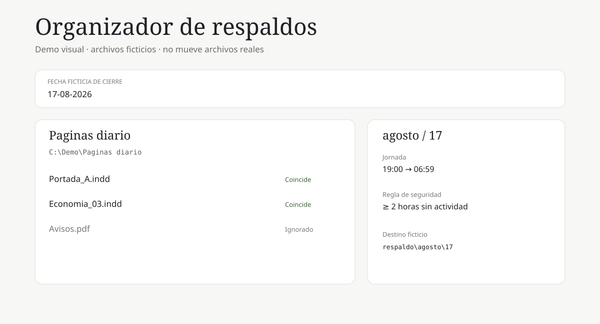

# Organizador-Respaldos-Windows

Automatización en Python para ordenar archivos de Adobe InDesign producidos durante una jornada nocturna. El caso de uso principal es una carpeta de trabajo que recibe archivos desde las 19:00 del día anterior hasta la madrugada del día de cierre; a las 07:00, si han pasado al menos 2 horas sin actividad, los `.indd` elegibles se mueven a `respaldo/<mes>/<día>`.

> La demo React usa exclusivamente datos ficticios y **no puede mover archivos reales**.



## Qué resuelve

Ejemplo ficticio para un cierre del **17-08-2026**:

```text
C:\Demo\Paginas diario\
├── Portada_A.indd        ← modificado 17-08 04:02
├── Economia_03.indd      ← modificado 17-08 03:41
├── Avisos.pdf            ← se ignora
└── respaldo\
    └── agosto\
        └── 17\
            ├── Portada_A.indd
            └── Economia_03.indd
```

La jornada considerada va desde las **19:00 del día anterior hasta las 06:59 del día de cierre**. Solo se procesan archivos `.indd` del nivel principal de `SOURCE_FOLDER`; la carpeta de respaldo se excluye del análisis y no se recorren subcarpetas.

## Instalación

Requiere Python 3.11 o superior.

```powershell
git clone https://github.com/Andrefnx/Project_Manager.git
cd Project_Manager
python -m venv .venv
.\.venv\Scripts\Activate.ps1
pip install -r requirements.txt
Copy-Item .env.example .env
```

## Configuración de `.env`

```env
SOURCE_FOLDER=C:\Ruta\Ficticia\Paginas diario
BACKUP_FOLDER=C:\Ruta\Ficticia\Paginas diario\respaldo
LOG_LEVEL=INFO
```

Usa tus rutas locales únicamente en `.env`. Ese archivo está ignorado por Git y nunca debe publicarse.

## Ejecución manual

```powershell
python src/main.py
```

El script valida el origen, crea el respaldo cuando corresponde, comprueba que hayan pasado al menos 120 minutos desde la última actividad del nivel principal y procesa cada archivo de forma independiente. Si un destino ya existe, genera un nombre seguro como `pagina (1).indd` sin sobrescribir nada.

### Dry-run

```powershell
python src/main.py --dry-run
```

Muestra qué archivos se moverían, pero no crea la carpeta de fecha ni mueve archivos.

### Probar una fecha ficticia

```powershell
python src/main.py --date 17-08-2026 --dry-run
```

`--date` representa la **fecha de cierre**. Para `17-08-2026`, la ventana elegible empieza el 16 a las 19:00 y termina el 17 a las 06:59.

## Programador de tareas de Windows

El script `scripts/setup_task.ps1` registra una tarea diaria a las **07:00** usando rutas absolutas y el usuario actual. No solicita privilegios de administrador.

```powershell
powershell -ExecutionPolicy Bypass -File .\scripts\setup_task.ps1
```

Comprobar la tarea:

```powershell
Get-ScheduledTask -TaskName "Organizador-Respaldos-Windows"
Get-ScheduledTaskInfo -TaskName "Organizador-Respaldos-Windows"
```

Ejecutarla manualmente:

```powershell
Start-ScheduledTask -TaskName "Organizador-Respaldos-Windows"
```

Eliminarla:

```powershell
powershell -ExecutionPolicy Bypass -File .\scripts\setup_task.ps1 -Remove
```

Una ejecución diaria a las 07:00 garantiza que el movimiento solo ocurra **si ya existen 2 horas o más sin actividad**. Si se necesitara ejecutar lo más cerca posible del instante exacto de las 2 horas, la tarea tendría que dispararse con mayor frecuencia.

## Pruebas

```powershell
pytest -q
```

Las pruebas usan carpetas temporales y cubren: filtro `.indd`, ventana nocturna, inactividad mínima, `--dry-run`, origen inexistente y nombres de destino sin sobrescritura.

## Demo React

```powershell
cd demo
npm install
npm run dev
```

La interfaz permite cambiar una fecha ficticia, alternar entre dry-run y ejecución simulada, ver archivos elegibles y revisar un historial visual. Ninguna acción del navegador accede al sistema de archivos local.

### GitHub Pages

El workflow `.github/workflows/pages.yml` compila `demo/` y despliega la demo cuando cambia `main`. En GitHub, activa **Settings → Pages → Source: GitHub Actions**.

Una vez habilitado Pages, la URL esperada para este repositorio es:

`https://andrefnx.github.io/Project_Manager/`

## Códigos de salida

- `0`: ejecución completada sin errores de movimiento.
- `1`: uno o más elementos fallaron, pero el resto continuó procesándose.
- `2`: configuración inválida o carpeta de origen inexistente.
- `3`: error fatal inesperado.

## Solución de errores

**No se mueve nada aunque hay `.indd`:** comprueba la hora de modificación. Debe caer entre las 19:00 del día anterior y las 06:59 de la fecha de cierre, y la carpeta debe llevar al menos 2 horas sin actividad.

**La tarea programada usa otro Python:** vuelve a registrarla indicando el ejecutable del entorno virtual:

```powershell
powershell -ExecutionPolicy Bypass -File .\scripts\setup_task.ps1 -PythonExe ".\.venv\Scripts\python.exe"
```

**El destino ya contiene un archivo con el mismo nombre:** no se sobrescribe. Se usa un sufijo numérico seguro.

**La demo no aparece en Pages:** verifica que Pages use GitHub Actions y revisa el workflow `Deploy demo to GitHub Pages`.

## Estructura

```text
src/
  main.py
  config.py
  file_mover.py
tests/
scripts/
  setup_task.ps1
demo/
docs/
.env.example
requirements.txt
README.md
LICENSE
```

## Licencia

MIT.
